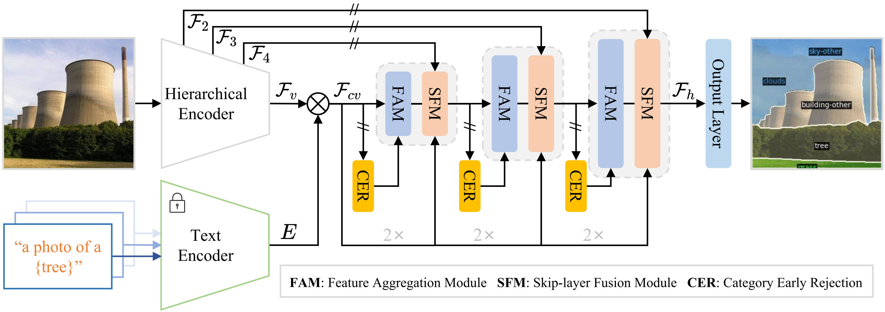
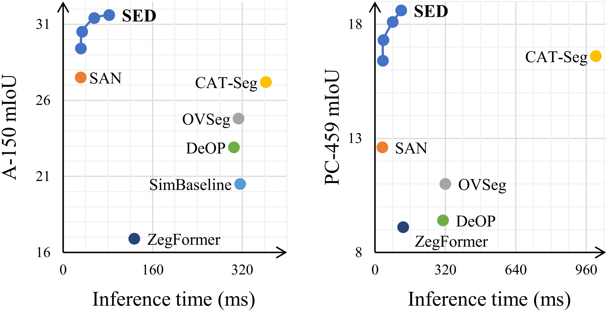

# SED: A Simple Encoder-Decoder for Open-Vocabulary Semantic Segmentation

This is our official pytorch implementation of SED.

## :fire: News
- SED is accepted by CVPR 2024.

## Introduction
<br>
- We propose an encoder-decoder for open-vocabulary semantic segmentation comprising a hierarchical encoder-based cost map generation and a gradual fusion decoder.
- We introduce a category early rejection scheme to reject non-existing categories at the early layer, which aids in markedly 
  increasing the inference speed without any significant degradation in  segmentation performance. For instance, it provides 4.7  times acceleration on PC-459.
- Our proposed method, SED, achieves the superior performance on  multiple open-vocabulary  segmentation datasets. 
  Specifically, the proposed SED provides a good trade-off in terms of segmentation performance and speed. 
  When using ConvNeXt-L, our proposed SED obtains mIoU scores of 35.2\% on A-150 and 22.6\% on PC-459.

For further details and visualization results, please check out our [paper](https://arxiv.org/abs/2311.15537).

## Installation
Please follow [installation](INSTALL.md). 

## Data Preparation
Please follow [dataset preperation](datasets/README.md).

## Training
We provide shell scripts for training and evaluation. ```run.sh``` trains the model in default configuration and evaluates the model after training. 

To train or evaluate the model in different environments, modify the given shell script and config files accordingly.

### Training script
```bash
sh run.sh [CONFIG] [NUM_GPUS] [OUTPUT_DIR] [OPTS]

# For ConvNeXt-B variant
sh run.sh configs/convnextB_768.yaml 4 output/
# For ConvNeXt-L variant
sh run.sh configs/convnextL_768.yaml 4 output/
```

## Evaluation
```eval.sh``` automatically evaluates the model following our evaluation protocol, with weights in the output directory if not specified.
To individually run the model in different datasets, please refer to the commands in ```eval.sh```.

### Evaluation script
```bash
sh run.sh [CONFIG] [NUM_GPUS] [OUTPUT_DIR] [OPTS]

sh eval.sh configs/convnextB_768.yaml 4 output/ MODEL.WEIGHTS path/to/weights.pth

# Fast version.
sh eval.sh configs/convnextB_768.yaml 4 output/ MODEL.WEIGHTS path/to/weights.pth  TEST.FAST_INFERENCE True  TEST.TOPK 8
```

## Results
<br>
We provide pretrained weights for our models reported in the paper. All of the models were evaluated with 4 NVIDIA A6000 GPUs, and can be reproduced with the evaluation script above. 
The inference time is reported on a single NVIDIA A6000 GPU.

<table><tbody>
<!-- START TABLE -->
<!-- TABLE HEADER -->
<th valign="bottom">Name</th>
<th valign="bottom">CLIP</th>
<th valign="bottom">A-847</th>
<th valign="bottom">PC-459</th>
<th valign="bottom">A-150</th>
<th valign="bottom">PC-59</th>
<th valign="bottom">PAS-20</th>
<th valign="bottom">Download</th>
<!-- TABLE BODY -->
<!-- ROW: SED (B) -->
<tr>
<td align="center">SED (B)</a></td>
<td align="center">ConvNeXt-B</td>
<td align="center">11.2</td>
<td align="center">18.6</td>
<td align="center">31.8</td>
<td align="center">57.7</td>
<td align="center">94.4</td>
<td align="center"><a href="https://drive.google.com/file/d/1qx6zGZgSPkF6TObregRz4uzQqSRHrgUw/view?usp=drive_link">ckpt</a>&nbsp;
</tr>
<!-- ROW: SED (B) -->
<tr>
<td align="center">SED-fast (B)</a></td>
<td align="center">ConvNeXt-B</td>
<td align="center">11.4</td>
<td align="center">18.6</td>
<td align="center">31.6</td>
<td align="center">57.3</td>
<td align="center">94.4</td>
<td align="center"><a href="https://drive.google.com/file/d/1qx6zGZgSPkF6TObregRz4uzQqSRHrgUw/view?usp=drive_link">ckpt</a>&nbsp;
</tr>
<!-- ROW: SED (L) -->
<tr>
<td align="center">SED (L)</a></td>
<td align="center">ConvNeXt-L</td>
<td align="center">13.7</td>
<td align="center">22.1</td>
<td align="center">35.3</td>
<td align="center">60.9</td>
<td align="center">96.1</td>
<td align="center"><a href="https://drive.google.com/file/d/1zAXE0QXy47n0cVn7j_2cSR85eqxdDGg8/view?usp=drive_link">ckpt</a>&nbsp;
</tr>
<!-- ROW: SED-fast (L) -->
 <tr><td align="center">SED-fast (L)</a></td>
<td align="center">ConvNeXt-L</td>
<td align="center">13.9</td>
<td align="center">22.6</td>
<td align="center">35.2</td>
<td align="center">60.6</td>
<td align="center">96.1</td>
<td align="center"><a href="https://drive.google.com/file/d/1zAXE0QXy47n0cVn7j_2cSR85eqxdDGg8/view?usp=drive_link">ckpt</a>&nbsp;
</tr>
</tbody></table>


## Citation

```BibTeX
@inproceedings{xie2024sed,
      title={SED: A Simple Encoder-Decoder for Open-Vocabulary Semantic Segmentation}, 
      author={Bin Xie and Jiale Cao and Jin Xie and Fahad Shahbaz Khan and Yanwei Pang},
      booktitle={Proceedings of the IEEE/CVF Conference on Computer Vision and Pattern Recognition},
      year={2024},
}
```

## Acknowledgement
We would like to acknowledge the contributions of public projects, such as [CAT-Seg](https://github.com/KU-CVLAB/CAT-Seg), whose code has been utilized in this repository.
